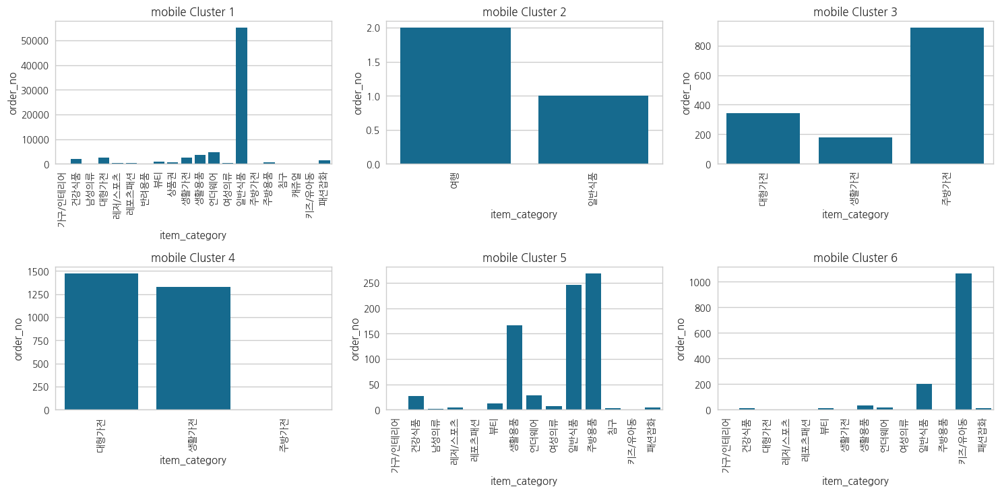

# curmmerce_project

고객의 구매 활동성을 높이고 추가 구매 유도를 위한 분석
==============

요약
--------------------------------------
1. 기본 정보
- 개인 프로젝트(기여도 100%)
***
2. 프로젝트 진행 배경
- cohort 배우고 이를 적용하기 위해 실시했습니다.
- k-mean클러스터링을 배우고 이를 분석에 활용하기 위해 실시했습니다.
- a/b테스트를 배우고 이를 활용해보기 위해 실시했습니다.
***
3. 데이터셋
- online_commerce_data.csv 
  - ['customer_no', 'age', 'gender', 'order_no', 'order_date', 'channel', 'item_category', 'item_code', 'item_name', 'price', 'qty', 'order_amount', 'discount_amount', 'paid_amount']

상세
--------
***
### 1. 문제 정의
- 2015년부터 시작한 이 기업의 2021년 월별 신규 이용자의 수와 재구매율은 지속적으로 감소하고 있습니다.
- 5월달까지는 총 매출이 지속적으로 상승하고 있었지만 6월달에 총 매출이 20% 감소하였습니다. 
- TV판매의 매출은 계속 증가하고 있었지만 모바일 판매의 경우 6월에 감소하였습니다.
- 모바일 매출의 지속적인 감소로 이어지지 않게 하기 위해 모바일 구매자들을 세그먼트하고 맞춤 상품을 제안하여 구매 활동성을 높이기 위한 방안을 제시하기 위해 분석을 진행했습니다.

***
### 2. 문제 인식

- 2021년 6월의 신규 이용자 수는 3월 신규 이용자 수의 30%로 4개월간 70% 줄었습니다.
- 신규 이용자들의 재구매율 또한 지속적으로 감소하는 것을 알 수 있습니다.
  - 2월 신규 이용자의 재구매율은 74%로 2021년 중에 제일 높습니다. 하지만 이후 신규 이용자의 다음달 재구매율은 감소하고 있습니다.
  - 하지만 4월 재구매율은 지속적으로 감소하여 45%도 안되는걸 확인 할 수 있습니다.
- 6월의 매출은 5월 매출 대비 20% 감소하였습니다.
- 신규 이용자와 재구매율이 지속적으로 감소하는 동향을 띄고있어서 6월의 매출 감소는 이후 총 매출액의 지속적인 감소로 이어지는 시발점으로 해석될 수 있습니다.
-------

### 3. EDA
###### 1. 판매 채널(TV와 모바일) 비교 탐색

- TV 매출은 꾸준히 증가하는 반면 모바일의 6월 매출은 감소했습니다.
- 모바일 판매 거래 비중이 tv보다 14.6% 더 높습니다
- 위의 두 가지 정보로 인해 총 매출의 감소 원인은 모바일 매출의 감소에 영향을 받은 것을 알 수있습니다.
----
###### 2. 할인 탐색

- 할인을 활용해 성사된 거래는 전체 거래중 47.6%입니다
- 산점도를 확인해보면 TV는 할인율이 증가함에 따라 주문 금액도 증가하는 거래들이 존재합니다.
  - 반대로 모바일의 경우 주문 금액이 높은 대다수의 거래들의 할인율이 10% 이하입니다.
- tv의 경우 할인율이 높을수록 모바일보다 거래 빈도수가 증가합니다.
  - 반면에 모바일의 경우 할인율이 높아도 거래 빈도수는 낮고 오히려 할인율이 없거나 낮을때(15% 이하) 더 많이 일어납니다.

----
### 4. 예상 시나리오
##### 1. 모바일 고객들을 군집화하여 특징을 찾고 맞춤형 추가 구매 유도를 위한 방안을 찾으면 되지 않을까?
- 이유 
  1. 고객들의 모바일 판매 거래 비중이 14.6% 더 높습니다.
  2. TV의 총 매출은 꾸준히 우상향하고 있지만 모바일의 경우 6월에 감소하였습니다.
- 해결 방안
  1. 고객들을 군집화하여 여러 개의 고객 집단을 만든다
  2. 해당 집단별로 분석을 실시하여 마케팅 방안을 모색한다.
---------

### 5. k-mean 클러스터 모델 적용
##### 1. k-mean 클러스터링
- 모바일 고객 군집화(k-mean 클러스터링)
  - 고객들의 구매 데이터를 가지고 고객들을 분류하기 위해 k-mean 클러스터링 모델을 사용하였습니다.

- 클러스터 개수를 찾기 위해 클러스터별 실루엣 계수 파악 및 시각화하였습니다.
  - 6개의 클러스터일때 실루엣 계수가 제일 0에 가깝기 때문에 클러스터 갯수는 6개로 선택 하였습니다.

--------
### 6. 분석
##### 군집 파악 및 정의

- 클러스터 1번 집단 : 작은 집에 혼자 사는 고객들
  - 이유 : 생수 구매가 제일 많고 언더웨어와 즉석식품 구매가 그 다음으로 많다. 그리고 고객들의 연령대가 주로 30~40대이다.
- 클러스터 2번 집단 : 캠핑을 좋아하는 고객들
  - 이유 : 캠핑 용품인 코펠/식기를 주로 구매했다
- 클러스터 3번 집단 : 음식점을 운영하는 고객들
  - 이유 : 구매 물품 중 밥솥이 제일 많고 냉장고, 공기 청정기 등 음식점에 필요한 물품들이기 때문이다.
  - 30대, 남성들이 주요 고객들이다.
- 클러스터 4번 집단 : 신혼집으로 이사하는 고객들
  - 이유 : 구매 비중이 높은 물품이 세탁기, 냉장고, TV 등 전부 가젠제품이기 때문이다.
  - 30대, 남성들이 주요 고객들이다.
- 클러스터 5번 집단 : 식당을 운영하는 고객들
  - 이유 : 여성 고객의 비율이 70%이고 구매한 물품이 생수, 비닐팩, 주방장갑 같은 가정 용품이기 때문이다.
  - 40대 이상의 여성들이 주요 고객들이다.
- 클러스터 6번 집단 : 자녀가 존재하는 고객들
  - 이유 : 대부분의 구매 물품이 이유식, 분유, 기저귀 등 유아 물품이기 때문이다.
  - 30대 중반~40대 초반 여성이 주요 고객이다.
-------
##### 1. 할인여부에 다른 주문 금액 차이 분석
- 할인 여부에 따른 주문 금액 차이를 알아보고자 t-test를 진행하였습니다.
###### 모델 설정
- 비교 지표 : 할인 받은 거래, 할인을 받지 않은 거래
- 관심 지표 : 할인 여부(0은 할인X, 1은 할인O)
- 귀무 가설 : 할인 여부로 인한 결제 금액의 차이는 존재하지 않는다
- 대립 가설 : 할인 여부로 인한 결제 금액의 차이는 존재한다
###### 집단별 분석 결과
1. 작은 집에 혼자 사는 고객들
   - p-value가 0으로 유의수준(0.05)보다 작아 할인 여부가 주문 금액에 영향을 끼친다는 대립 가설을 채택하게 됩니다.
2. 캠핑을 좋아하는 고객들
   - 분석 불가 : 해당 군집의 고객수가 분석을 진행하기에는 적어 분석이 불가능했습니다.
3. 음식점을 운영하는 고객들
     - p-value가 0.68로 유의수준(0.05)보다 높아 할인 여부로 인한 결제 금액의 차이는 존재한다는 귀무가설을 기각하지 못해 할인 여부와 주문 금액은 서로 영향을 끼치지 못합니다.
4. 신혼집으로 이사하는 고객들
     - 분석 불가 : 할인을 받지 않은 거래가 존재하지 않아 분석이 불가능 했습니다.
5. 식당을 운영하는 고객들
     - p-value가 1.67로 유의수준(0.05)보다 커서 귀무 가설을 기각하지 못했습니다. 이는 할인여부로 인한 결제 금액의 차이는 존재하지 않는다고 할 수 있습니다.
6. 자녀가 존재하는 고객들
     - p-value가 9.08로 유의수준(0.05)보다 커서 귀무 가설을 기각하지 못했습니다. 이는 할인여부로 인한 결제 금액의 차이는 존재하지 않는다고 할 수 있습니다.
--- 
##### 2. 집단별 할인과 주문 금액 선형 회귀 분석
- 여러가지 요인들(가격, 할인율, 나이)을 가지고 주문 금액을 예측하여 어느 요인이 주문 금액에 영향을 얼마나 끼치는지 파악하기 위해 선형회귀 분석을 진행하였습니다.
###### 모델 설정
- 변수 : [할인율, 나이, 가격, 주문수량](독립 변수), 주문 금액(종속 변수)
  - 종속 변수 정규화 : 같은 집단 내의 가격 차이가 크기 때문에 정규화하여 진행하였습니다
  - 독립 변수 정규화 : 독립 변수 간의 수치 차이가 크기 때문에 정규화를 진행했습니다.
- 귀무 가설 : [할인율, 나이, 가격, 주문수량]각각의 요인들과 주문 금액은 서로 관계가 없다.
- 대립 가설 : [할인율, 나이, 가격, 주문수량]각각의 요인들과 주문 금액은 서로 관계가 있다.
###### 집단별 분석 결과
1. 작은 집에 혼자 사는 고객들
              - 
    - 할인율, 나이, 가격, 주문수량 모두 주문 금액에 통계적으로 유의미하다고 볼 수 있습니다. 
    - 하지만 나이는 상관계수가 0에 가까워 할인율이 증가해도 주문 금액의 변동이 크지 않을 것이라고 판단됩니다.
    - 주문 금액에 대한 가격과 주문수량의 상관계수는 0.4이상으로 주문 금액에 큰 비중을 차지합니다.
    - 할인율의 경우 주문 금액과의 상관계수가 0.33으로 가격과 주문수량에는 못 미치지만 할인율이 증가하면 주문 금액이 유의미하게 증가할 것으로 판단됩니다.
    - 예측 모델의 결과 모델의 적합성도 높은 것으로 확인됩니다(모델=분석의 신뢰성이 높다).
2. 캠핑을 좋아하는 고객들
   - 분석 불가 : 해당 군집의 고객수가 분석을 진행하기에는 적어 분석이 불가능했습니다.
3. 음식점을 운영하는 고객들
    - 
     - 할인율과 나이의 p-value가 모두 높아 통계적으로 무의미 합니다.
     - 높은 가격의 물품을 구매하는 집단이여서 물품 가격이 주문 금액을 예측하는데 가장 큰 비중을 차지하고 그 다음으로 주문 수량이 비중을 차지합니다.
4. 신혼집으로 이사하는 고객들

    - 
     - 할인율과 나이는 p-value가 높아 주문 금액과 통계적으로 유의미하다고 볼 수 없습니다.
     - 주문수량은 상관계수가 0에 가까워 주문 금액에 영향을 끼치는 요인으로 판단되기 어렵습니다
     - 가격 하나로 주문 금액 예측 모델의 적합성이 뛰어나기 때문에 가격을 이용한 마케팅이 효과적으로 보입니다.
5. 식당을 운영하는 고객들
    - 
     - 할인율, 가격, 주문 수량이 p-value가 0.05보다 작아 주문 금액과 통계적으로 유의미합니다.
     - 할인율과 주문 수량은 작지만 양의 상관계수를 가지고 있습니다.(할인율과 주문 수량이 높으면 주문 금액이 증가한다.)
     - 예측에 실패한 값들도 여럿보입니다. 이는 이 집단에서 주문 금액에 영향을 미치는 다른 요인들이 있다고 판단됩니다.
6. 자녀가 존재하는 고객들
    - 
     - 모든 요인이 주문 금액과 통계적으로 유의미한 관계를 가지고 있습니다.
     - 다만 주문 수량과 나이는 상관계수가 0.1미만으로 0에 가까워 주문 금액의 증가에 상관이 없다고 판단됩니다.
     - 할인율의 경우 상관계수가 0.16으로 약한 상관관계를 가지고 있습니다.
----------

### 6. 결론
1. 작은 집에 혼자 사는 고객들
- 이들이 주로 구매하는 물품은 생수, 즉석식품과 같은 일반 식품과 언더웨어였습니다.
- 가격의 변동에도 수요가 쉽게 변하지 않는 필수재에 해당하는 생수의 판매 비중이 독보적으로 높은 것에 비해 할인 여부와 할인율의 크기가 모두 주문 금액에 영향을 끼칩니다. 이는 해당 고객들은 할인이 결제하는데 있어 매우 큰 영향을 끼친다고 판단되고 이를 활용한 방안이 적합하다고 생각합니다.
  - 구매활동성 증가와 추가 구매 유도를 하기 방안
    - 최저금액 할인 쿠폰 배포 : 할인여부와 할인율이 클수록 주문 금액이 증가하는 상관관계가 있기 때문에 일정 금액 구매시 큰 할인율을 제공하는 쿠폰을 제공하는 방안입니다.
    - 연관재로 할인 제공 : 이들이 구매하는 필수재에 이 집단의 고객들이 구매하는 식품들을 추가로 구매하면 추가 할인을 해주는 방안입니다. 이로 인해 고객들의 추가 구매를 유도할 수 있다고 생각합니다.
    - 많은 수량 구매시 개당 가격 할인 : 같은 물품을 많이 구매할 시 개당 가격에 할인을 적용해줘서 많은 수량을 유도하는 방안입니다.
2. 음식점을 운영하는 고객들, 가전제품을 판매하는 고객들
- 이들의 경우 대부분의 구매 물품이 밥솥, 전자레인지였습니다.
- 할인 여부와 할인율과 이들의 구매 금액은 상관관계가 없었습니다. 하지만 이들이 구매하는 물품들은 대부분 단가가 높은 물품들이였습니다. 따라서 단가를 낮추는 방안으로 고객들을 유도할 수 있다고 생각합니다.
  - 구매활동성 증가와 추가 구매 유도를 하기 방안
    - 묶음 판매 : 이들의 주요 구매 물품이 주방 가전인만큼 주방에 해당하는 상품들을 묶음으로 판매하여 홍보하고 구매 활동성을 증가시키는 방안입니다. 예를들어 밥솥을 구매하면 판매하는 쌀을 일부 묶음으로 판매하여 묶음 상품인 쌀을 홍보하고 밥솥의 판매를 촉진하는 방안입니다.
3. 신혼집으로 이사하는 고객들
- 해당 고객들은 대부분 새로운 집에 필요한 세탁기, 냉장고, tv같은 물품들이였습니다. 이 물품들은 모두 가격이 비싼 물품들로 보통 새로운 집으로 이사할때 한꺼번에 구매하는 물품들입니다. 물품 가격이 이들의 구매 활동에 제일 큰 영향을 끼칩니다. 물품 가격을 낮춰서 구매를 유도하지만 매출은 증가시키는 방안이 필요하다고 생각합니다.
  - 추가 구매를 유도하는 방안
    - 세트 판매 유도 : 빈집으로 이사할때 모든 가전 제품을 새로운 것으로 구매를 하는 경우가 많습니다. 일부 품목을 다른 판매자한테서 구매하지 않게 하기위해 세트 판매 방안을 추천합니다. 예를들면 건조기와 세탁기를 세트로 묶어 구매를 유도하거나 냉장고와 김치냉장고를 세트로 묶어 낱개로 사는 가격보다 저렴한 가격에 제공합니다. 이로인해 다른 물품에 대해서도 추가 구매를 유도할 수 있습니다.
4. 식당을 운영하는 고객들
- 이들의 구매 물품은 체중계, 생수, 지퍼백 등 식당 주방에서 사용되는 품목들이였습니다.
- 이들은 모두 할인율과 주문수량에 따른 주문금액의 상관계수는 낮았습니다. 고객들의 추가 구매를 유도하기 위해서는 식당과 관련된 물품들을 추천 혹은 제안하는 방안이 적합하다고 판단됩니다. 비록 할인 여부에 따른 주문 금액 차이는 없지만 할인이 제공되었을 때의 주문 금액은 조금이나마 증가하기 때문에 이를 이용한 방안이 필요하다고 생각합ㄴ디ㅏ.
  - 추가 구매를 유도하는 방안
    - 주방 용품 구매 시 식료품 할인 제공 : 이들의 주 구매 품목이 주방 용품인 것을 이용하여 주방 용품을 구매할시 식료품 할인 쿠폰을 제공하여 식료품의 추가 구매를 유도하는 방안입니다.
5. 자녀가 존재하는 고객들
- 이들의 주요 구매 품목은 이유식, 분유, 기저귀 였습니다.
- 이들도 할인 여부에 따른 구매 금액의 차이는 존재하지 않았지만 할인율 증가와 구매 금액 증가는 조금의 상관관계가 존재했습니다. 그리고 이들의 구매 품목은 갓난 애기들에게 필요한 필수 물품들로 아이들을 키우는데 주기적으로 많이 필요한 물품들입니다. 
  - 고객의 구매 활동성을 높이는 방안
    - 주기적인 상품 할인 홍보 : 이 집단 고객들의 구매하는 품목들은 소비 품목들로 일정 기간이 지나면 부족하여 다시 구매를 해야하는 품목들입니다. 따라서 이들이 구매한 품목들의 평균 소비기간 혹은 재구매기간을 집계하여 해당 기간이 지날때마다 할인을 제공하거나 더 나은 제품을 홍보하여 고객의 구매 활동성을 증가시킬 수 있습니다.
-----
### 7. 리뷰
- 판매 채널에서 모바일 고객들로만 진행하였습니다.
  - TV 고객들로도 진행하여 A/B테스트를 진행해보면 어땠을까하는 생각이 듭니다.
- 클러스터 개수를 실루엣 계수로 구하고 이를 적용하였는데 실루엣 계수 그래프가 매끄럽지 않고 클러스터링을 진행한 결과중 2번 집단의 고객수는 매우 적어 분석이 불가능한 수준이였습니다. 이는 클러스터링을 진행함에 있어 아쉬움이 듭니다.
- 상관 회귀 분석을 실시하였는데 독립 변수를 설정하는 부분에서 주문수량과 고객을 독립변수에 넣어야할지 말아야할지 계속 고민하였습니다.
- 이를 모델에 적용하여 예측하고 예측한 결과를 해석하면서 제 자신도 독립변수와 종속변수의 관계를 풀어나가는데 긴가민가하여 회귀 분석에 대해 조금 더 공부가 필요하다고 깨달았습니다.
